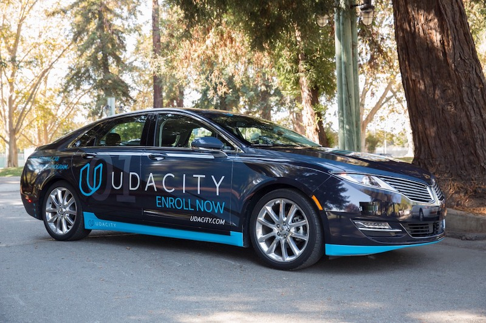
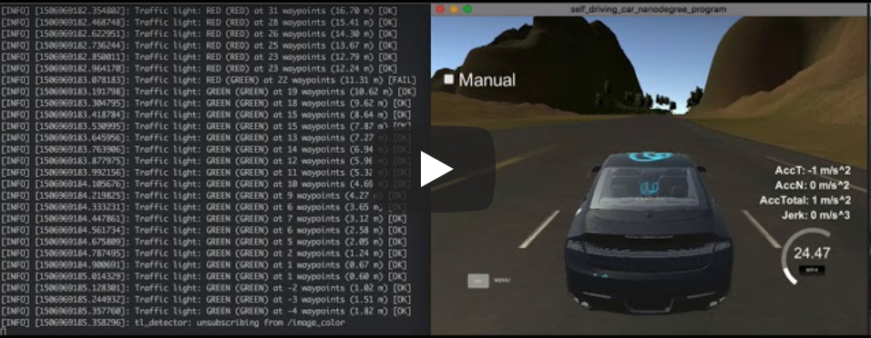
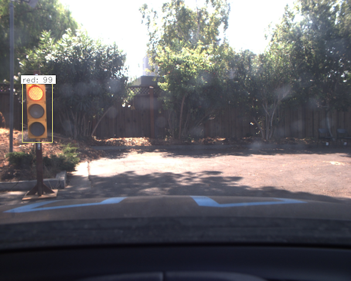
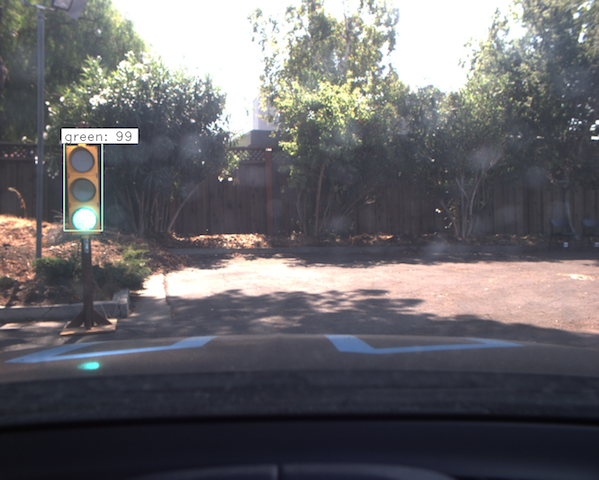

# Udacity Self-Driving Car Nanodegree: Term 3
# Capstone Project: System Integration
# Team: ASILD

## Team Members
  - David Moriano (lead) : david.moriano@gmail.com
  - Benoit Miroux : benoit.miroux@gmail.com
  - Pierre Merriaux : pierre.merriaux@gmail.com
  - Sean Devlin : seanpdevlin@gmail.com
  - Tim Abrahamsen : tim.abrahamsen@gmail.com

## Introduction
This is the final capstone project for Udacity's Self-Driving Car Nanodegree. It combines previous lessons on waypoint following, PID control, image recognition, and ROS to navigate a self-driving car around a track, while stopping for red lights.

## Concepts
Concepts explored in this project:

  - ROS
  - Image recognition and classification
  - Waypoint following
  - PID control
  
## Viewing the Project

You must have Ubuntu 16.04 or 14.04 installed to run the project. To run the project on the simulator, follow the instructions [here](./INSTALL.md) to download and install ROS and the Udacity simulator, and to build and run the project.

Source code for ROS nodes is located in [./ros/src]().

## Write-Up

The [starter code](https://github.com/udacity/CarND-Capstone) for this project includes a framework for ROS nodes for perception, planning, and control of a self-driving car. The diagram for the whole system is below:

The work of this project focuses on three ROS nodes:

  - A waypoint updater ([./ros/src/waypoint_updater]()) that feeds a list of next waypoints to a waypoint follower, and determines the target speed (necessary for maintaining desired velocity and stopping for red lights).
  
  - A controller ([./ros/src/twist_controller]()) that takes in the target linear and angular velocities from the waypoint follower, and calculates steering angle and throttle/brake values using a PID controller.
  
  - A traffic light detector ([./ros/src/tl_detector]()) that takes in images from a forward-facing camera, determines if there is a traffic light in the image, and if so determines the color of the traffic light.

### Waypoint Updater

The `waypoint_updater` node subscribes to the `/base_waypoints` topic, which contains an array of waypoints for the entire track. The `waypoint_updater` node finds for the closest waypoint in front of the car, and publishes an array of the next 200 waypoints to the `/final_waypoints` topic, which is used by the `waypoint_follower` node to determine the target linear and angular velocity for the car.

The array of waypoints published to `/final_waypoints` includes the x and y coordinates of each waypoint, as well as their target linear velocities. This is necessary for keeping the car in the lane, as well as maintaining the desired velocity and stopping for red lights.

The `waypoint_updater` node also subscribes to the `/traffic_waypoint` topic, which contains the nearest waypoint to the stop line of a red light, if one is found. It uses this information to command appropriate target velocities for the car to stop for red lights (and to go for green lights).

### Twist Controller

The `/twist_controller` node subscribes to the `/current_velocity` and `/twist_cmd` topics, which give the actual and target velocities (linear and angular) of the car, respectively.

It calculates the desired throttle, braking, and steering using a PID controller and a physical model of the car (which includes parameters such as mass, wheel radius, etc), and publishes the steering, throttle, and brake commands to the `vehicle/steering_cmd`, `vehicle/throttle_cmd`, and `vehicle/brake_cmd` topics, respectively, which command the actuators in the car.

### Traffic Light Detector

The `tl_detector` node subscribes to the following topics:

- `/vehicle/traffic_lights`: An array of waypoints for known traffic lights on the track
- `/camera_info`: Calibration parameters for the camera
- `/image_color`: A color image taken by the camera
- `/current_pose`: Position and orientation of the car
- `/base_waypoints`: The array of all waypoints for the track

The `tl_detector` node uses a convolutional neural network to find traffic lights in image published in `/image_color` and determine the color of the light (see below).

**Red light**

**Green light**

The `tl_detector` node then publishes color of the light and the waypoint nearest the stop line for the light, which are used by the `waypoint_updater` node to determine target velocities to either stop at a light or go through it.